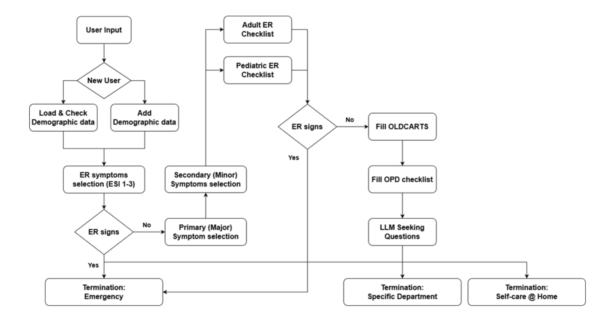

## ThaiLLM Prescreen Ruleset

This repository contains rulesets used to gather information from patients to support prescreening features. The rules are stored in the [`v1/`](./v1/) directory. The goals of prescreening are:

1. **Department routing** — redirect the patient to the appropriate hospital department (12 departments)
2. **Differential diagnosis (DDx)** — narrow down possible diseases from a [curated pool](./v1/const/diseases.yaml)
3. **Severity assessment** — triage into one of 4 levels: Observe at Home, Visit Hospital/Clinic, Visit Hospital/Clinic Urgently, or Emergency



### Prescreen Flow (6 phases)

| Phase | Name | File(s) | Description |
|-------|------|---------|-------------|
| 0 | Demographic inquiry | [`demographic.yaml`](./v1/rules/demographic.yaml) | Collect date of birth, gender, height, weight, underlying diseases, medical history, occupation, and presenting complaint. |
| 1 | ER critical symptom screen | [`er_symptom.yaml`](./v1/rules/er/er_symptom.yaml) | 11 life-threatening yes/no checks (unconsciousness, seizure, stroke signs, chest pain, severe bleeding, etc.). If any is true, early-terminate with Emergency severity. |
| 2 | Symptom selection | — | Patient selects ONE primary symptom and zero or more secondary symptoms from the [16 NHSO symptoms](./v1/const/nhso_symptoms.yaml). |
| 3 | ER checklist | [`er_adult_checklist.yaml`](./v1/rules/er/er_adult_checklist.yaml), [`er_pediatric_checklist.yaml`](./v1/rules/er/er_pediatric_checklist.yaml) | Age-dependent checklist keyed by primary symptom. Adults use `min_severity` (a floor); children use `severity` (an exact override). Each item may also override the default department. |
| 4 | OLDCARTS | [`oldcarts.yaml`](./v1/rules/oldcarts.yaml) | Symptom-specific decision tree following the [OLDCARTS](https://www.onlinemeded.com/blog/oldcarts-acronym) mnemonic, curated by doctors based on 16 NHSO symptoms. Gathers detailed info for DDx, department routing, and severity assessment. |
| 5 | OPD | [`opd.yaml`](./v1/rules/opd.yaml) | Conditional decision tree that uses answers from phase 4 to determine the final department assignment. |

This repository also includes an inspector web app for visualizing and editing the rule graphs through a UI.

### Repository Structure

```
v1/
├── const/                          # Reference data (departments, diseases, symptoms, severity levels)
├── images/                         # Medical images for image question types
└── rules/
    ├── demographic.yaml            # Phase 0: demographic fields
    ├── er/
    │   ├── er_symptom.yaml         # Phase 1: critical yes/no checks
    │   ├── er_adult_checklist.yaml # Phase 3: adult ER checklist
    │   └── er_pediatric_checklist.yaml  # Phase 3: pediatric ER checklist
    ├── oldcarts.yaml               # Phase 4: OLDCARTS decision trees
    └── opd.yaml                    # Phase 5: OPD routing decision trees
inspector/                          # FastAPI web inspector app
tests/                              # Pydantic-based YAML validation tests
```

### Quickstart (Inspector)

1. Install (from repo root):

```bash
uv pip install -e .
```

2. Run the inspector:

```bash
prescreen-inspector
```

3. Open the browser at `http://localhost:8000`.

Use the dropdown to pick a symptom and choose a view mode:

- Combined: Oldcarts flow with a virtual OPD node connected to OPD entry
- Oldcarts: Only Oldcarts tree and OPD handoff
- OPD: Only OPD decision tree

Notes:

- The app reads YAML directly from `v1/rules/` and constants from `v1/const/`.
- Image assets under `v1/images/` are not required for visualization, but Oldcarts validations rely on their presence.

## Testing (pytest)

Run the unit tests locally with pytest.

```bash
# Install dependencies
uv pip install -e .

# Run all tests
pytest -q

# Run a specific test file or test
pytest tests/test_opd.py -q
pytest tests/test_opd.py::test_opd_schema_and_parsing -q
```

Useful flags:

- `-q` quiet output
- `-k "pattern"` filter tests by substring
- `-x` stop on first failure

Test coverage includes:

- **Constants** — schema validation for diseases, NHSO symptoms, departments, severity levels
- **Demographic** — field schema, qid format, enum/from_yaml type validation
- **ER** — all 3 ER YAML files: schema, qid conventions, severity/department ID referential integrity, cross-file consistency
- **OLDCARTS** — decision tree schema, graph connectivity, conditional coverage, image asset existence
- **OPD** — decision tree schema, goto targets, reachability, predicate semantic validation

## Scripts

### Pipeline Simulation

Run a full end-to-end simulation of the `PrescreenPipeline` with mocked DB and LLM components. The script drives through all 6 rule-based phases plus LLM questioning and prediction, printing rich audit logs of every question and answer.

```bash
# Default run (Headache symptom)
python scripts/simulate_pipeline.py

# Choose a different symptom
python scripts/simulate_pipeline.py -s Fever

# List available NHSO symptoms
python scripts/simulate_pipeline.py --list-symptoms

# Verbose mode (include schemas in output)
python scripts/simulate_pipeline.py -v
```

## Limitations

Although these rulesets are curated by doctors for research purposes, they carry many limitations and should be used with caution on the application side, especially in the medical domain where accuracy is critical for downstream applications.
- These rulesets are constructed based on 16 NHSO symptoms. If users present symptoms that are more specific than the provided 16 NHSO symptoms, the system may fail to gather accurate information.
- The DDx was designed only for research purposes, and the supported diseases are limited to [this list](./v1/const/diseases.yaml).
- When constructing the rules, we prioritized question coverage over simplicity, so some questions may be redundant.

## Authors
- **Chompakorn Chaksangchaichot**: Core Developer
- **Sukrit Sriratanawilai**: Researcher
- **Terasut Numwong**: Researcher, Medical Expert

We would like to extend our gratitude to every doctor who contributed to this program by curating a very thorough ruleset, as well as DEPA and BDI for sponsoring this research grant. This project is part of the ThaiLLM project.
