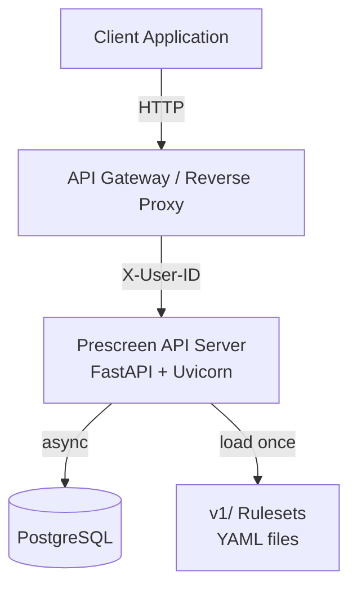
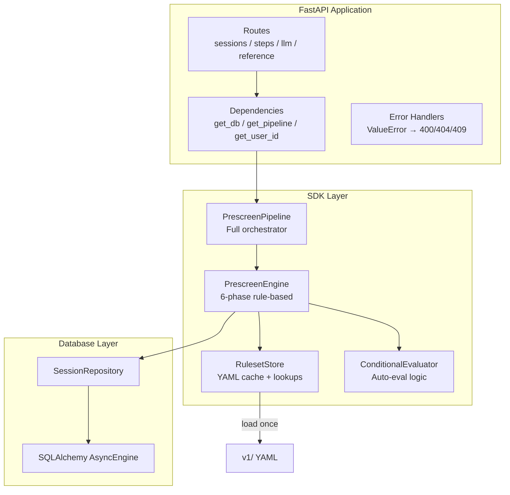
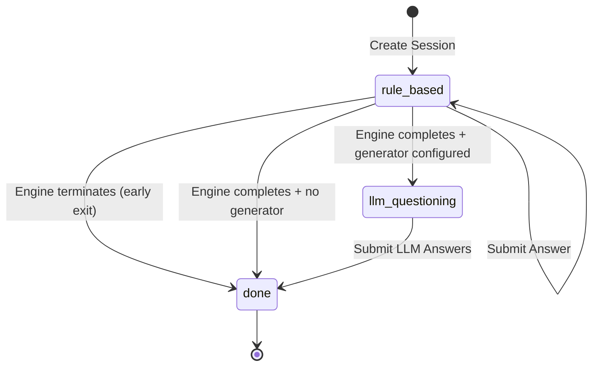

# Architecture

## System Overview

## Internal Components

## Request Lifecycle

1. **Request arrives** at a route handler (e.g. `POST /api/v1/sessions/{id}/step`)
2. **Dependencies resolve:** `get_user_id` extracts the `X-User-ID` header, `get_db` opens an async DB session, `get_pipeline` returns the singleton pipeline
3. **Pipeline dispatches** based on `pipeline_stage`:
    - `rule_based` → delegates to `PrescreenEngine`
    - `llm_questioning` → returns stored LLM questions or processes LLM answers
    - `done` → returns cached result
4. **Engine computes the step:** loads session from DB, evaluates the decision tree, auto-resolves filters/conditionals, returns a `StepResult`
5. **Response serialized** as JSON via Pydantic models
6. **Transaction committed** by the `get_db` dependency (or rolled back on error)

## Pipeline Stages

## Stateless Engine Pattern

The `PrescreenEngine` is **stateless** — it does not hold any session data in memory between requests. On every call:

1. Load the full session state from the database
2. Compute the next step based on current phase, answers, and decision tree
3. Persist any changes (via `flush()` — the caller controls `commit()`)
4. Return the result

This means:

- The server can be scaled horizontally (multiple instances behind a load balancer)
- Any instance can handle any request for any session
- No sticky sessions or session affinity required

## Dependency Injection

FastAPI's `Depends()` system provides:

| Dependency | Scope | Purpose |
|------------|-------|---------|
| `get_db()` | Per-request | Async DB session with auto commit/rollback |
| `get_pipeline()` | Singleton | `PrescreenPipeline` instance (created at startup) |
| `get_store()` | Singleton | `RulesetStore` instance (loaded at startup) |
| `get_user_id()` | Per-request | Extracts and validates `X-User-ID` header |
| `require_admin_key()` | Per-request | Validates `X-Admin-Key` header against `ADMIN_API_KEY` env var |

## Startup (Lifespan)

At server startup, the lifespan handler:

1. Loads all YAML rulesets into a `RulesetStore`
2. Creates a `PrescreenEngine` with the store
3. Creates a `PrescreenPipeline` wrapping the engine
4. Stashes everything on `app.state` for dependency injection

At shutdown, the database engine's connection pool is disposed.

## Error Handling Strategy

Rather than catching errors in every route handler, the server uses **global exception handlers**:

| Exception | HTTP Status | Logic |
|-----------|-------------|-------|
| `ValueError` containing "already exists" | 409 Conflict | Duplicate session |
| `ValueError` containing "already deleted" | 409 Conflict | Double soft-delete |
| `ValueError` containing "not found" | 404 Not Found | Unknown session/resource |
| `ValueError` containing "only valid during" | 400 Bad Request | Wrong pipeline stage |
| `ValueError` (other) | 400 Bad Request | Fallback |
| `KeyError` | 404 Not Found | Unknown reference ID |
| `Exception` | 500 Internal Server Error | Catch-all with logged traceback |

This keeps route handlers clean — they focus on the happy path and let exceptions propagate to the global handlers.
