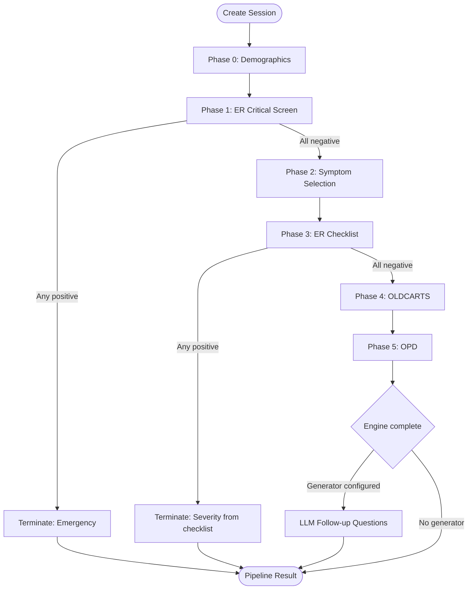

# Flow Walkthrough

This page walks through a complete prescreening session, phase by phase, with concrete request/response examples for every phase and question type.

## Overview

Every session progresses through up to 6 rule-based phases, optionally followed by LLM questions and a prediction stage:



## Pipeline Stages

The session's `pipeline_stage` field tracks the macro-stage:

| Stage | What's happening | Valid operations |
|-------|-----------------|-----------------|
| `rule_based` | Phases 0-5 questions | `GET /step`, `POST /step`, `GET /history` |
| `llm_questioning` | LLM follow-up questions | `GET /step`, `POST /llm-answers`, `GET /history` |
| `done` | Final result available | `GET /step` (returns cached result with history), `GET /history` |

---

## Reference Data: Enums & Fixed Values

Several fields in the API accept only fixed values. Use the reference endpoints or the tables below to discover valid values.

### Gender

The `gender` field in demographics accepts exactly one of these strings:

| Value | Description |
|-------|-------------|
| `"Male"` | Biological male |
| `"Female"` | Biological female |

### Underlying Diseases

The `underlying_diseases` field accepts a list of disease names (English). Pass an empty list `[]` if the patient has none.

Fetch dynamically: `GET /api/v1/reference/underlying-diseases`

| Value | Thai Name |
|-------|-----------|
| `"Hypertension"` | ความดันโลหิตสูง |
| `"Dyslipidemia"` | ไขมันในเลือดผิดปกติ |
| `"Diabetes Mellitus"` | เบาหวาน |
| `"Chronic kidney disease"` | โรคไตเรื้อรัง |
| `"Chronic liver disease"` | โรคตับเรื้อรัง |
| `"Heart disease"` | โรคหัวใจ |
| `"Thyroid disease"` | ความผิดปกติของต่อมไทรอยด์ |
| `"Stroke"` | โรคหลอดเลือดสมอง |
| `"Obesity"` | โรคอ้วน |
| `"Chronic Obstructive Pulmonary Disease"` | โรคปอดอุดกั้นเรื้อรัง |
| `"Asthma"` | โรคหอบหืด |
| `"Tuberculosis"` | วัณโรค |
| `"HIV/AIDS"` | เอดส์ |
| `"Cancer"` | มะเร็ง |
| `"Allergy"` | โรคภูมิแพ้ |
| `"Alzheimer disease"` | โรคอัลไซเมอร์ |

### NHSO Symptoms

Used in Phase 2 for `primary_symptom` and `secondary_symptoms`.

Fetch dynamically: `GET /api/v1/reference/symptoms`

| Value | Thai Name |
|-------|-----------|
| `"Headache"` | ปวดหัว |
| `"Dizziness"` | เวียนหัว |
| `"Pain in Joint"` | ปวดข้อ |
| `"Muscle Pain"` | เจ็บกล้ามเนื้อ |
| `"Fever"` | ไข้ |
| `"Cough"` | ไอ |
| `"Sore Throat"` | เจ็บคอ |
| `"Stomachache"` | ปวดท้อง |
| `"Constipation"` | ท้องผูก |
| `"Diarrhea"` | ท้องเสีย |
| `"Dysuria"` | ถ่ายปัสสาวะขัด |
| `"Vaginal Discharge"` | ตกขาวผิดปกติ |
| `"Skin Rash/Lesion"` | ผื่น คัน |
| `"Wound"` | บาดแผล |
| `"Eye Disorder"` | ความผิดปกติที่เกิดขึ้นกับตา |
| `"Ear Disorder"` | ความผิดปกติที่เกิดขึ้นกับหู |

### Severity Levels

Fetch dynamically: `GET /api/v1/reference/severity-levels`

| ID | Name | Thai Name |
|----|------|-----------|
| `sev001` | Observe at Home | เฝ้าสังเกตอาการที่บ้าน |
| `sev002` | Visit Hospital / Clinic | เข้าพบโรงพยาบาลหรือคลินิก |
| `sev002_5` | Visit Hospital / Clinic Urgently | เข้าพบโรงพยาบาลภายใน 24 ชั่วโมง |
| `sev003` | Emergency | ฉุกเฉิน |

### Departments

Fetch dynamically: `GET /api/v1/reference/departments`

| ID | Name | Thai Name |
|----|------|-----------|
| `dept001` | Dermatology | แผนกผิวหนัง |
| `dept002` | Emergency Medicine | แผนกฉุกเฉิน |
| `dept003` | Forensic Medicine | นิติเวชศาสตร์ |
| `dept004` | Internal Medicine | อายุรกรรม |
| `dept005` | Obstetrics and Gynecology | สูติศาสตร์และนรีเวชวิทยา |
| `dept006` | Ophthalmology | จักษุวิทยา |
| `dept007` | Orthopedics and Physical Therapy | ออร์โธปิดิกส์และกายภาพบำบัด |
| `dept008` | Otorhinolaryngology | แผนกหูคอจมูก |
| `dept009` | Pediatrics | กุมารเวชศาสตร์ |
| `dept010` | Psychiatry | จิตเวชศาสตร์ |
| `dept011` | Rehabilitation | เวชศาสตร์ฟื้นฟู |
| `dept012` | Surgery | ศัลยกรรม |

---

## Phase 0 — Demographics

**Mode:** Bulk (all questions at once)

The first step collects patient demographic information. Several fields accept only fixed enum values (see [Reference Data](#reference-data-enums-fixed-values) above).

### Demographic fields

| Field | Type | Required | Accepted values |
|-------|------|----------|-----------------|
| `date_of_birth` | `string` | Yes | ISO date format `"YYYY-MM-DD"` |
| `gender` | `string` | Yes | `"Male"` or `"Female"` |
| `height` | `number` | Yes | Height in cm (e.g. `175`) |
| `weight` | `number` | Yes | Weight in kg (e.g. `70`) |
| `underlying_diseases` | `list[string]` | Yes | List of disease names from the [Underlying Diseases](#underlying-diseases) table, or `[]` for none |
| `medical_history` | `string` | No | Free text, or `"None"` |
| `occupation` | `string` | No | Free text |
| `presenting_complaint` | `string` | No | Free text describing the main symptom |

### Example: Submit demographics

=== "curl"

    ```bash
    # Get the demographics step
    curl http://localhost:8080/api/v1/sessions/sess-001/step \
      -H "X-User-ID: patient-1"

    # Submit demographics
    curl -X POST http://localhost:8080/api/v1/sessions/sess-001/step \
      -H "Content-Type: application/json" \
      -H "X-User-ID: patient-1" \
      -d '{
        "value": {
          "date_of_birth": "1990-01-15",
          "gender": "Male",
          "height": 175,
          "weight": 70,
          "underlying_diseases": ["Hypertension", "Diabetes Mellitus"],
          "medical_history": "None",
          "occupation": "Engineer",
          "presenting_complaint": "Headache for 3 days"
        }
      }'
    ```

=== "Python"

    ```python
    # Get the demographics step
    step = client.get(
        "/api/v1/sessions/sess-001/step",
        headers=headers,
    ).json()

    # Submit demographics
    next_step = client.post(
        "/api/v1/sessions/sess-001/step",
        json={
            "value": {
                "date_of_birth": "1990-01-15",
                "gender": "Male",
                "height": 175,
                "weight": 70,
                "underlying_diseases": ["Hypertension", "Diabetes Mellitus"],
                "medical_history": "None",
                "occupation": "Engineer",
                "presenting_complaint": "Headache for 3 days",
            }
        },
        headers=headers,
    ).json()
    ```

The response is the next step — Phase 1 (ER Critical Screen).

---

## Phase 1 — ER Critical Screen

**Mode:** Bulk (all 11 yes/no questions at once)

Eleven life-threatening checks. If **any** answer is `true`, the session terminates immediately with **Emergency** severity.

### Example: GET step response

```json
{
  "type": "questions",
  "phase": 1,
  "phase_name": "ER Critical Screen",
  "questions": [
    {"qid": "emer_critical_001", "question": "คนไข้มีอาการหมดสติ เรียกไม่รู้สึกตัวหรือไม่?", "question_type": "single_select"},
    {"qid": "emer_critical_002", "question": "มีกาการชักเกร็งหรือไม่?", "question_type": "single_select"},
    {"qid": "emer_critical_003", "question": "มีอาการซึม หรือสับสนหรือไม่", "question_type": "single_select"},
    {"qid": "emer_critical_004", "question": "มีอาการที่บ่งบอกถึงโรคหลอดเหลือสมองหรือไม่?...", "question_type": "single_select"},
    {"qid": "emer_critical_005", "question": "มีอาการหายใจเหนื่อยหอบ หายใจไม่ออกหรือไม่?", "question_type": "single_select"},
    {"qid": "emer_critical_006", "question": "มีอาการเจ็บแน่นหน้าอก...", "question_type": "single_select"},
    {"qid": "emer_critical_007", "question": "มีอาการหน้าหรือตัวเขียว/ซีด...", "question_type": "single_select"},
    {"qid": "emer_critical_008", "question": "มีเลือดออกเป็นจำนวนมาก...", "question_type": "single_select"},
    {"qid": "emer_critical_009", "question": "ได้รับสารพิษ สารเคมี หรือถูกสัตว์มีพิษร้ายแรงกัด...", "question_type": "single_select"},
    {"qid": "emer_critical_010", "question": "มีความเจ็บปวดรุนแรงมากกว่า 7/10 คะแนน...", "question_type": "single_select"},
    {"qid": "emer_critical_011", "question": "ประสบอุบัติเหตุรุนแรงเสี่ยงถึงชีวิต", "question_type": "single_select"}
  ]
}
```

### Example: Submit (all negative)

=== "curl"

    ```bash
    curl -X POST http://localhost:8080/api/v1/sessions/sess-001/step \
      -H "Content-Type: application/json" \
      -H "X-User-ID: patient-1" \
      -d '{
        "value": {
          "emer_critical_001": false,
          "emer_critical_002": false,
          "emer_critical_003": false,
          "emer_critical_004": false,
          "emer_critical_005": false,
          "emer_critical_006": false,
          "emer_critical_007": false,
          "emer_critical_008": false,
          "emer_critical_009": false,
          "emer_critical_010": false,
          "emer_critical_011": false
        }
      }'
    ```

=== "Python"

    ```python
    next_step = client.post(
        "/api/v1/sessions/sess-001/step",
        json={
            "value": {
                "emer_critical_001": False,
                "emer_critical_002": False,
                "emer_critical_003": False,
                "emer_critical_004": False,
                "emer_critical_005": False,
                "emer_critical_006": False,
                "emer_critical_007": False,
                "emer_critical_008": False,
                "emer_critical_009": False,
                "emer_critical_010": False,
                "emer_critical_011": False,
            }
        },
        headers=headers,
    ).json()
    ```

!!! warning "Early Termination"
    If any ER critical check is `true`, the response will be a `pipeline_result` (not `questions`), and the session is over:
    ```json
    {
      "type": "pipeline_result",
      "departments": [{"id": "dept002", "name": "Emergency Medicine", "name_th": "แผนกฉุกเฉิน", "description": "..."}],
      "severity": {"id": "sev003", "name": "Emergency", "name_th": "ฉุกเฉิน", "description": "..."},
      "diagnoses": [],
      "reason": "ER critical screen: emer_critical_001 positive",
      "terminated_early": true
    }
    ```

---

## Phase 2 — Symptom Selection

**Mode:** Bulk

The patient selects a primary symptom and optionally one or more secondary symptoms from the 16 NHSO symptom categories. Values must match the exact strings from the [NHSO Symptoms](#nhso-symptoms) table.

### Example: GET step response

```json
{
  "type": "questions",
  "phase": 2,
  "phase_name": "Symptom Selection",
  "questions": [
    {
      "qid": "primary_symptom",
      "question": "What is your primary symptom?",
      "question_type": "single_select",
      "options": [
        {"id": "Headache", "label": "Headache"},
        {"id": "Dizziness", "label": "Dizziness"},
        {"id": "Pain in Joint", "label": "Pain in Joint"},
        {"id": "Muscle Pain", "label": "Muscle Pain"},
        {"id": "Fever", "label": "Fever"},
        {"id": "Cough", "label": "Cough"},
        {"id": "Sore Throat", "label": "Sore Throat"},
        {"id": "Stomachache", "label": "Stomachache"},
        {"id": "Constipation", "label": "Constipation"},
        {"id": "Diarrhea", "label": "Diarrhea"},
        {"id": "Dysuria", "label": "Dysuria"},
        {"id": "Vaginal Discharge", "label": "Vaginal Discharge"},
        {"id": "Skin Rash/Lesion", "label": "Skin Rash/Lesion"},
        {"id": "Wound", "label": "Wound"},
        {"id": "Eye Disorder", "label": "Eye Disorder"},
        {"id": "Ear Disorder", "label": "Ear Disorder"}
      ]
    },
    {
      "qid": "secondary_symptoms",
      "question": "Do you have any secondary symptoms?",
      "question_type": "multi_select",
      "options": ["... same list as above ..."]
    }
  ]
}
```

### Example: Submit symptom selection

=== "curl"

    ```bash
    curl -X POST http://localhost:8080/api/v1/sessions/sess-001/step \
      -H "Content-Type: application/json" \
      -H "X-User-ID: patient-1" \
      -d '{
        "value": {
          "primary_symptom": "Headache",
          "secondary_symptoms": ["Dizziness", "Fever"]
        }
      }'
    ```

=== "Python"

    ```python
    next_step = client.post(
        "/api/v1/sessions/sess-001/step",
        json={
            "value": {
                "primary_symptom": "Headache",
                "secondary_symptoms": ["Dizziness", "Fever"],
            }
        },
        headers=headers,
    ).json()
    ```

!!! tip "Available Symptoms"
    Use `GET /api/v1/reference/symptoms` to fetch the full list of valid symptom names at runtime.

---

## Phase 3 — ER Checklist

**Mode:** Bulk

An age-appropriate checklist for the selected symptoms. The server automatically selects the **adult checklist** (age >= 15) or **pediatric checklist** (age < 15) based on the patient's date of birth. Like Phase 1, any positive answer can terminate the session early.

### Example: GET step response (adult, Headache)

```json
{
  "type": "questions",
  "phase": 3,
  "phase_name": "ER Checklist",
  "questions": [
    {"qid": "emer_adult_hea001", "question": "ปวดรุนแรงที่สุดในชีวิต / ปวดแบบฟ้าผ่า / ระดับอาการปวดศีรษะ ≥ 7/10", "question_type": "single_select"},
    {"qid": "emer_adult_hea002", "question": "ปวดศีรษะใหม่ที่รุนแรงมาก หลังออกแรง/ไอ/เบ่ง/มีเพศสัมพันธ์", "question_type": "single_select"},
    {"qid": "emer_adult_hea003", "question": "ปวดศีรษะรุนแรงและฉับพลันภายในเวลาไม่กี่วินาที (Thunderclap headache)", "question_type": "single_select"},
    {"qid": "emer_adult_hea004", "question": "อาการปวดศีรษะมากจนตื่น โดยเฉพาะช่วงเช้า...", "question_type": "single_select"},
    {"qid": "emer_adult_hea005", "question": "ไข้ร่วมกับ คอแข็ง หรือปวดศีรษะรุนแรงร่วมกับไข้", "question_type": "single_select"},
    {"qid": "emer_adult_hea006", "question": "มีผื่นร่วมกับไข้และปวดศีรษะรุนแรง", "question_type": "single_select"},
    {"qid": "emer_adult_hea007", "question": "ภูมิคุ้มกันต่ำ/กินยากดภูมิ/มะเร็ง/HIV...", "question_type": "single_select"},
    {"qid": "emer_adult_hea008", "question": "ปวดศีรษะหลัง ศีรษะกระแทก/อุบัติเหตุ...", "question_type": "single_select"},
    {"qid": "emer_adult_hea009", "question": "กินยาละลายลิ่มเลือด/ยาต้านการแข็งตัวของเลือด...", "question_type": "single_select"},
    {"qid": "emer_adult_hea010", "question": "ตั้งครรภ์มากกว่า 20 สัปดาห์ หรือหลังคลอด ≤ 6 สัปดาห์...", "question_type": "single_select"},
    {"qid": "emer_adult_hea011", "question": "ปวดตารุนแรง ตาแดง + ปวดศีรษะ", "question_type": "single_select"},
    {"qid": "emer_adult_hea012", "question": "เห็นแสงเป็นวงรุ้ง/ตามัวเฉียบพลัน...", "question_type": "single_select"},
    {"qid": "emer_adult_hea013", "question": "อายุ > 50 ปี และ ปวดศีรษะรูปแบบใหม่...", "question_type": "single_select"}
  ]
}
```

!!! note "Pediatric checklist"
    For patients under 15, the qids use the prefix `emer_ped_` instead (e.g. `emer_ped_hea001`). The questions differ but the submission format is the same.

### Example: Submit (all negative)

=== "curl"

    ```bash
    curl -X POST http://localhost:8080/api/v1/sessions/sess-001/step \
      -H "Content-Type: application/json" \
      -H "X-User-ID: patient-1" \
      -d '{
        "value": {
          "emer_adult_hea001": false,
          "emer_adult_hea002": false,
          "emer_adult_hea003": false,
          "emer_adult_hea004": false,
          "emer_adult_hea005": false,
          "emer_adult_hea006": false,
          "emer_adult_hea007": false,
          "emer_adult_hea008": false,
          "emer_adult_hea009": false,
          "emer_adult_hea010": false,
          "emer_adult_hea011": false,
          "emer_adult_hea012": false,
          "emer_adult_hea013": false
        }
      }'
    ```

=== "Python"

    ```python
    # Programmatic: answer False for every checklist item
    checklist_answers = {q["qid"]: False for q in step["questions"]}
    next_step = client.post(
        "/api/v1/sessions/sess-001/step",
        json={"value": checklist_answers},
        headers=headers,
    ).json()
    ```

!!! warning "Early Termination"
    If any ER checklist item is `true`, the response is a `pipeline_result`. The severity and department depend on the specific item:

    - **Most items** default to Emergency (`sev003`) and Emergency Medicine (`dept002`).
    - **Some items** override to a different severity or department (e.g. `emer_adult_hea004` terminates with Visit Hospital Urgently `sev002_5`).

    Example termination response:
    ```json
    {
      "type": "pipeline_result",
      "departments": [{"id": "dept002", "name": "Emergency Medicine", "name_th": "แผนกฉุกเฉิน", "description": "..."}],
      "severity": {"id": "sev002_5", "name": "Visit Hospital / Clinic Urgently", "name_th": "...", "description": "..."},
      "diagnoses": [],
      "reason": "ER checklist: emer_adult_hea004 positive",
      "terminated_early": true
    }
    ```

---

## Phase 4 — OLDCARTS (Sequential)

**Mode:** Sequential (one question at a time)

A symptom-specific decision tree following the OLDCARTS framework (Onset, Location, Duration, Character, Aggravating/Alleviating, Radiation, Timing, Severity). The engine auto-resolves filter and conditional questions behind the scenes and only presents user-facing questions.

Each `GET /step` returns **one question**. Submit the answer, then `GET /step` again for the next question. The question type varies — see the examples below for each type.

### Question types in OLDCARTS/OPD

| Question Type | Shown to user? | Answer format | Description |
|---------------|:--------------:|---------------|-------------|
| `single_select` | Yes | Option ID string | Pick one option |
| `multi_select` | Yes | List of option IDs | Pick one or more options |
| `free_text` | Yes | String | Open-ended text input |
| `free_text_with_fields` | Yes | Object with field values | Structured text with named sub-fields |
| `number_range` | Yes | Number | Numeric value within min/max constraints |
| `image_single_select` | Yes | Option ID string | Pick one option with image context |
| `image_multi_select` | Yes | List of option IDs | Pick one or more options with image context |
| `gender_filter` | No | *(auto-evaluated)* | Routes based on patient gender |
| `age_filter` | No | *(auto-evaluated)* | Routes based on patient age |
| `conditional` | No | *(auto-evaluated)* | Evaluates rules against prior answers |

!!! info "Auto-evaluated question types"
    `gender_filter`, `age_filter`, and `conditional` questions are resolved automatically by the server using data already collected. They are never shown to the client. The server skips them and serves the next user-facing question.

### Example: `single_select`

**GET step response:**

```json
{
  "type": "questions",
  "phase": 4,
  "phase_name": "OLDCARTS",
  "questions": [
    {
      "qid": "hea_o_002",
      "question": "เคยปวดหัวแบบนี้มาก่อนไหม?",
      "question_type": "single_select",
      "options": [
        {"id": "เคย", "label": "เคย"},
        {"id": "ไม่เคย", "label": "ไม่เคย"}
      ]
    }
  ]
}
```

**Submit:** send the option `id` as the value.

=== "curl"

    ```bash
    curl -X POST http://localhost:8080/api/v1/sessions/sess-001/step \
      -H "Content-Type: application/json" \
      -H "X-User-ID: patient-1" \
      -d '{"value": "เคย"}'
    ```

=== "Python"

    ```python
    next_step = client.post(
        "/api/v1/sessions/sess-001/step",
        json={"value": "เคย"},
        headers=headers,
    ).json()
    ```

### Example: `multi_select`

**GET step response:**

```json
{
  "type": "questions",
  "phase": 4,
  "phase_name": "OLDCARTS",
  "questions": [
    {
      "qid": "hea_c_001",
      "question": "ลักษณะอาการ ปวดหัวเป็นแบบใด? ตุบ ตื้อ แปล๊บ หรือแน่นๆ?",
      "question_type": "multi_select",
      "options": [
        {"id": "ตุบ", "label": "ตุบ"},
        {"id": "ตื้อ", "label": "ตื้อ"},
        {"id": "แปล๊บ", "label": "แปล๊บ"},
        {"id": "แน่นๆ", "label": "แน่นๆ"}
      ]
    }
  ]
}
```

**Submit:** send a list of selected option `id`s.

=== "curl"

    ```bash
    curl -X POST http://localhost:8080/api/v1/sessions/sess-001/step \
      -H "Content-Type: application/json" \
      -H "X-User-ID: patient-1" \
      -d '{"value": ["ตุบ", "แน่นๆ"]}'
    ```

=== "Python"

    ```python
    next_step = client.post(
        "/api/v1/sessions/sess-001/step",
        json={"value": ["ตุบ", "แน่นๆ"]},
        headers=headers,
    ).json()
    ```

### Example: `free_text`

**GET step response:**

```json
{
  "type": "questions",
  "phase": 4,
  "phase_name": "OLDCARTS",
  "questions": [
    {
      "qid": "hea_o_001",
      "question": "เริ่มมีอาการปวดหัวตั้งแต่เมื่อไร?",
      "question_type": "free_text"
    }
  ]
}
```

**Submit:** send a plain string.

=== "curl"

    ```bash
    curl -X POST http://localhost:8080/api/v1/sessions/sess-001/step \
      -H "Content-Type: application/json" \
      -H "X-User-ID: patient-1" \
      -d '{"value": "3 วันก่อน"}'
    ```

=== "Python"

    ```python
    next_step = client.post(
        "/api/v1/sessions/sess-001/step",
        json={"value": "3 วันก่อน"},
        headers=headers,
    ).json()
    ```

### Example: `free_text_with_fields`

**GET step response:**

```json
{
  "type": "questions",
  "phase": 4,
  "phase_name": "OLDCARTS",
  "questions": [
    {
      "qid": "hea_a_001",
      "question": "มีอะไรที่ทำให้อาการปวดหัวดีขึ้นหรือแย่ลง?",
      "question_type": "free_text_with_fields",
      "fields": [
        {"id": "สิ่งที่ทำแล้วอาการดีขึ้น", "label": "สิ่งที่ทำแล้วอาการดีขึ้น", "kind": "text"},
        {"id": "สิ่งที่ทำแล้วอาการแย่ลง", "label": "สิ่งที่ทำแล้วอาการแย่ลง", "kind": "text"}
      ]
    }
  ]
}
```

**Submit:** send an object whose keys are the field `id`s.

=== "curl"

    ```bash
    curl -X POST http://localhost:8080/api/v1/sessions/sess-001/step \
      -H "Content-Type: application/json" \
      -H "X-User-ID: patient-1" \
      -d '{"value": {"สิ่งที่ทำแล้วอาการดีขึ้น": "กินยาแก้ปวด", "สิ่งที่ทำแล้วอาการแย่ลง": "แสงจ้า เสียงดัง"}}'
    ```

=== "Python"

    ```python
    next_step = client.post(
        "/api/v1/sessions/sess-001/step",
        json={
            "value": {
                "สิ่งที่ทำแล้วอาการดีขึ้น": "กินยาแก้ปวด",
                "สิ่งที่ทำแล้วอาการแย่ลง": "แสงจ้า เสียงดัง",
            }
        },
        headers=headers,
    ).json()
    ```

### Example: `number_range`

**GET step response:**

```json
{
  "type": "questions",
  "phase": 4,
  "phase_name": "OLDCARTS",
  "questions": [
    {
      "qid": "hea_s_001",
      "question": "ถ้าให้คะแนนจาก 0-10 ตอนนี้ปวดหัวระดับไหน?",
      "question_type": "number_range",
      "constraints": {
        "min_value": 0,
        "max_value": 10,
        "step": 1,
        "inclusive": true
      }
    }
  ]
}
```

**Submit:** send a number within the range.

=== "curl"

    ```bash
    curl -X POST http://localhost:8080/api/v1/sessions/sess-001/step \
      -H "Content-Type: application/json" \
      -H "X-User-ID: patient-1" \
      -d '{"value": 5}'
    ```

=== "Python"

    ```python
    next_step = client.post(
        "/api/v1/sessions/sess-001/step",
        json={"value": 5},
        headers=headers,
    ).json()
    ```

### Example: `image_multi_select`

**GET step response:**

```json
{
  "type": "questions",
  "phase": 4,
  "phase_name": "OLDCARTS",
  "questions": [
    {
      "qid": "sto_l_001",
      "question": "ปวดบริเวณใดของท้อง มีจุดปวดชัดเจนหรือปวดทั่วท้อง?",
      "question_type": "image_multi_select",
      "image": "stomach.png",
      "options": [
        {"id": "stomach_1", "label": "ท้องส่วนบนด้านขวา"},
        {"id": "stomach_2", "label": "ลิ้นปี่"},
        {"id": "stomach_3", "label": "ท้องส่วนบนด้านซ้าย"},
        {"id": "stomach_4", "label": "เอวด้านขวา"},
        {"id": "stomach_5", "label": "รอบสะดือ"},
        {"id": "stomach_6", "label": "เอวด้านซ้าย"},
        {"id": "stomach_7", "label": "ท้องส่วนล่างด้านขวา"},
        {"id": "stomach_8", "label": "ท้องส่วนล่างตรงกลาง"},
        {"id": "stomach_9", "label": "ท้องส่วนล่างด้านซ้าย"},
        {"id": "stomach_all", "label": "ปวดทั่วท้อง"}
      ]
    }
  ]
}
```

**Submit:** send a list of selected option `id`s (same as `multi_select`).

=== "curl"

    ```bash
    curl -X POST http://localhost:8080/api/v1/sessions/sess-001/step \
      -H "Content-Type: application/json" \
      -H "X-User-ID: patient-1" \
      -d '{"value": ["stomach_2", "stomach_5"]}'
    ```

=== "Python"

    ```python
    next_step = client.post(
        "/api/v1/sessions/sess-001/step",
        json={"value": ["stomach_2", "stomach_5"]},
        headers=headers,
    ).json()
    ```

!!! note "`image_single_select`"
    Works the same as `image_multi_select` but the answer is a single option ID string (not a list), just like `single_select`.

---

## Phase 5 — OPD (Sequential)

**Mode:** Sequential (one question at a time)

The OPD (Outpatient Department) decision tree routes the patient to a specific department and assigns a severity level. Same request/response pattern as Phase 4 — call `GET /step`, submit an answer via `POST /step`, repeat.

OPD trees make heavy use of **auto-evaluated** question types (`age_filter`, `gender_filter`, `conditional`) which are resolved server-side without client interaction. The server automatically skips these and serves the next user-facing question.

### Example: `single_select` in OPD

**GET step response:**

```json
{
  "type": "questions",
  "phase": 5,
  "phase_name": "OPD",
  "questions": [
    {
      "qid": "hea_opd_005",
      "question": "อาการปวดหัวเกิดขึ้นบ่อยหรือไม่?",
      "question_type": "single_select",
      "options": [
        {"id": "yes", "label": "ใช่ ปวดบ่อย"},
        {"id": "no", "label": "ไม่ ปวดไม่บ่อย"}
      ]
    }
  ]
}
```

**Submit:**

=== "curl"

    ```bash
    curl -X POST http://localhost:8080/api/v1/sessions/sess-001/step \
      -H "Content-Type: application/json" \
      -H "X-User-ID: patient-1" \
      -d '{"value": "yes"}'
    ```

=== "Python"

    ```python
    next_step = client.post(
        "/api/v1/sessions/sess-001/step",
        json={"value": "yes"},
        headers=headers,
    ).json()
    ```

When the OPD tree reaches a terminal node, the rule-based engine is complete:

- If a **generator** is configured, the pipeline transitions to `llm_questioning`
- Otherwise, the pipeline returns a `pipeline_result` directly

---

## LLM Follow-Up Questions

If the pipeline has a question generator configured, after the rule-based phases complete, the step response will have `type: "llm_questions"`:

```json
{
  "type": "llm_questions",
  "questions": [
    "Does the headache get worse when you bend forward?",
    "Have you experienced any visual disturbances?"
  ]
}
```

Submit answers using the LLM answers endpoint:

=== "curl"

    ```bash
    curl -X POST http://localhost:8080/api/v1/sessions/sess-001/llm-answers \
      -H "Content-Type: application/json" \
      -H "X-User-ID: patient-1" \
      -d '[
        {"question": "Does the headache get worse when you bend forward?", "answer": "Yes"},
        {"question": "Have you experienced any visual disturbances?", "answer": "No"}
      ]'
    ```

=== "Python"

    ```python
    result = client.post(
        "/api/v1/sessions/sess-001/llm-answers",
        json=[
            {"question": "Does the headache get worse when you bend forward?", "answer": "Yes"},
            {"question": "Have you experienced any visual disturbances?", "answer": "No"},
        ],
        headers=headers,
    ).json()
    ```

## LLM Prompt Rendering

The API can render the current step as an LLM-ready prompt string, useful when building an AI-powered client:

=== "curl"

    ```bash
    curl http://localhost:8080/api/v1/sessions/sess-001/llm-prompt \
      -H "X-User-ID: patient-1"
    ```

Response:

```json
{
  "prompt": "Phase 0 — Demographics\n\nPlease provide the following..."
}
```

Returns `{"prompt": null}` when the session is in the `done` stage.

---

## Final Result

When the pipeline completes, the step response has `type: "pipeline_result"`. The response includes a `history` array containing the full chronological Q&A trail for the session:

```json
{
  "type": "pipeline_result",
  "departments": [
    {
      "id": "dept004",
      "name": "Internal Medicine",
      "name_th": "อายุรกรรม",
      "description": "Specializes in the prevention, diagnosis, and treatment of diseases affecting adults..."
    }
  ],
  "severity": {
    "id": "sev002",
    "name": "Visit Hospital / Clinic",
    "name_th": "เข้าพบโรงพยาบาลหรือคลินิกเมื่อสะดวกเพื่อตรวจสอบอาการเพิ่ม",
    "description": "Symptoms require medical evaluation but are not life-threatening at this moment."
  },
  "diagnoses": [
    {"disease_id": "d042", "confidence": 0.82},
    {"disease_id": "d015", "confidence": 0.45}
  ],
  "reason": "OPD routing: hea_opd_005 → dept004",
  "terminated_early": false,
  "history": [
    {"qid": "demo_dob", "question_type": "datetime", "question": "วันเกิด", "answer": "1990-01-15", "phase": 0, "source": "rule_based"},
    {"qid": "demo_gender", "question_type": "enum", "question": "เพศ", "answer": "Male", "phase": 0, "source": "rule_based"},
    {"qid": "emer_critical_001", "question_type": "yes_no", "question": "คนไข้มีอาการหมดสติ เรียกไม่รู้สึกตัวหรือไม่?", "answer": false, "phase": 1, "source": "rule_based"},
    {"qid": "primary_symptom", "question_type": "single_select", "question": "อาการหลัก", "answer": "Headache", "phase": 2, "source": "rule_based"},
    {"qid": "hea_o_001", "question_type": "free_text", "question": "เริ่มมีอาการปวดหัวตั้งแต่เมื่อไร?", "answer": "3 วันก่อน", "phase": 4, "source": "rule_based"},
    {"qid": null, "question_type": null, "question": "Does the headache get worse when you bend forward?", "answer": "Yes", "phase": null, "source": "llm_generated"}
  ]
}
```

### History entry fields

Each entry in `history` contains:

| Field | Type | Description |
|-------|------|-------------|
| `qid` | `string \| null` | Question ID (e.g. `"hea_o_001"`). Null for LLM-generated questions. |
| `question_type` | `string \| null` | Question type (e.g. `"single_select"`, `"free_text"`, `"yes_no"`). Null for LLM-generated. |
| `question` | `string` | The question text shown to the user. |
| `answer` | `any` | The user's answer. Type varies: `bool` (ER yes/no), `string`, `list[string]`, `object`, or `number`. |
| `phase` | `int \| null` | Phase number (0-5) for rule-based questions. Null for LLM-generated. |
| `source` | `string` | `"rule_based"` or `"llm_generated"`. |

!!! tip "History is always present"
    The `history` array is included in every `pipeline_result` response, including early terminations. For early terminations, it will contain the questions answered up to the point of termination.

---

## Session History Endpoint

You can also retrieve the Q&A history at any point during a session — not just after completion — using the dedicated history endpoint:

=== "curl"

    ```bash
    curl http://localhost:8080/api/v1/sessions/sess-001/history \
      -H "X-User-ID: patient-1"
    ```

=== "Python"

    ```python
    history = client.get(
        "/api/v1/sessions/sess-001/history",
        headers=headers,
    ).json()
    ```

**Response:** a JSON array of history entries (same shape as `pipeline_result.history`):

```json
[
  {"qid": "demo_dob", "question_type": "datetime", "question": "วันเกิด", "answer": "1990-01-15", "phase": 0, "source": "rule_based"},
  {"qid": "demo_gender", "question_type": "enum", "question": "เพศ", "answer": "Male", "phase": 0, "source": "rule_based"},
  {"qid": "emer_critical_001", "question_type": "yes_no", "question": "คนไข้มีอาการหมดสติ เรียกไม่รู้สึกตัวหรือไม่?", "answer": false, "phase": 1, "source": "rule_based"}
]
```

!!! info "Mid-session access"
    Unlike the `pipeline_result` payload (which is only available when the session reaches the `done` stage), the `/history` endpoint works at any pipeline stage. It returns whatever Q&A pairs have been collected so far, making it useful for progress tracking, debugging, or displaying a conversation log in the UI.

---

## Answer Format Summary

| Question Type | Value type | Example value |
|---------------|-----------|---------------|
| `single_select` | String (option ID) | `"เคย"` |
| `multi_select` | List of strings (option IDs) | `["ตุบ", "แน่นๆ"]` |
| `free_text` | String | `"3 วันก่อน"` |
| `free_text_with_fields` | Object (field ID → value) | `{"field_id_1": "value1", "field_id_2": "value2"}` |
| `number_range` | Number | `5` |
| `image_single_select` | String (option ID) | `"stomach_2"` |
| `image_multi_select` | List of strings (option IDs) | `["stomach_2", "stomach_5"]` |

---

## Dispatching on Step Type

Your client should dispatch on the `type` field of each step response:

```python
step = client.get(f"/api/v1/sessions/{sid}/step", headers=headers).json()

match step["type"]:
    case "questions":
        # Render questions, collect answers, POST /step
        render_questions(step["questions"])

    case "llm_questions":
        # Render LLM questions, collect answers, POST /llm-answers
        render_llm_questions(step["questions"])

    case "pipeline_result":
        # Show the final result
        show_result(step["departments"], step["severity"], step["diagnoses"])
```
